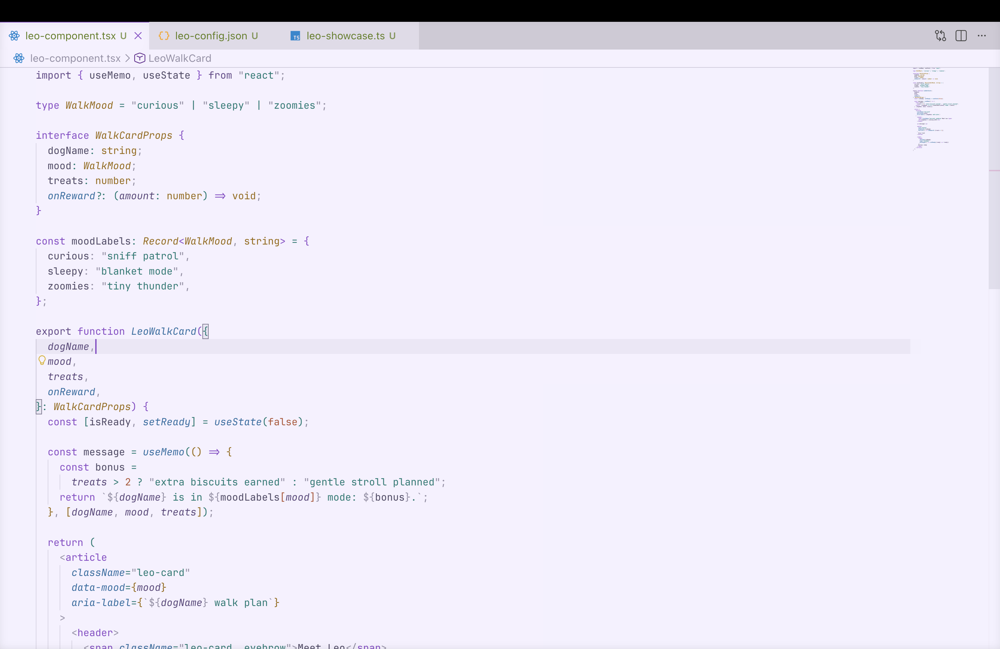
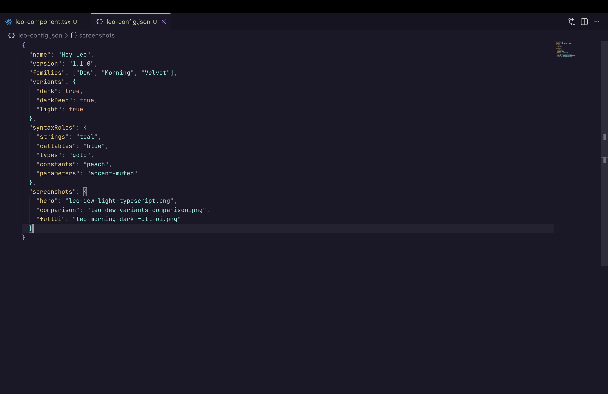
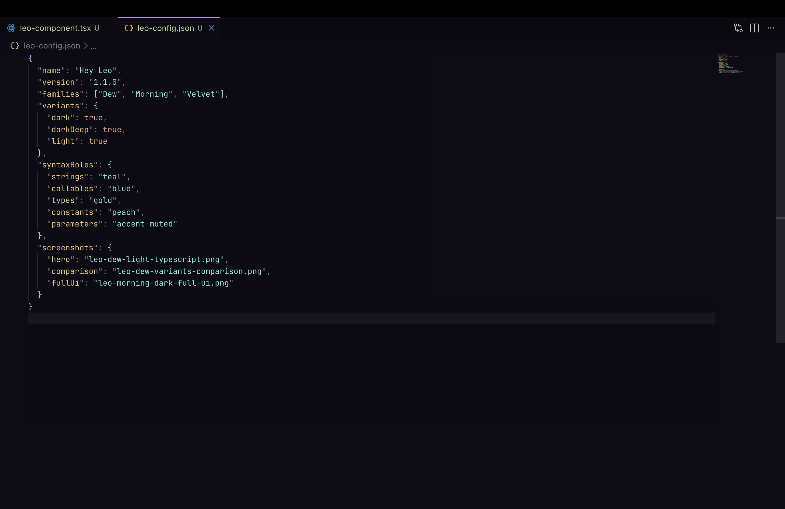
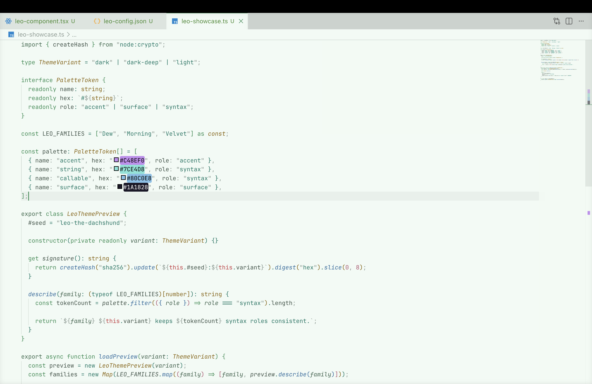
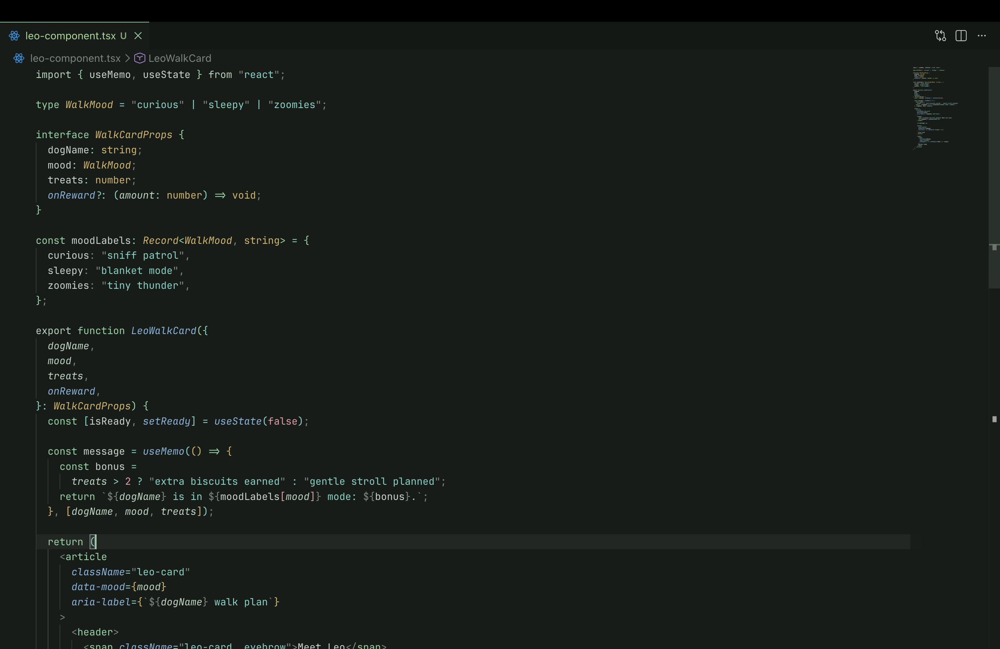
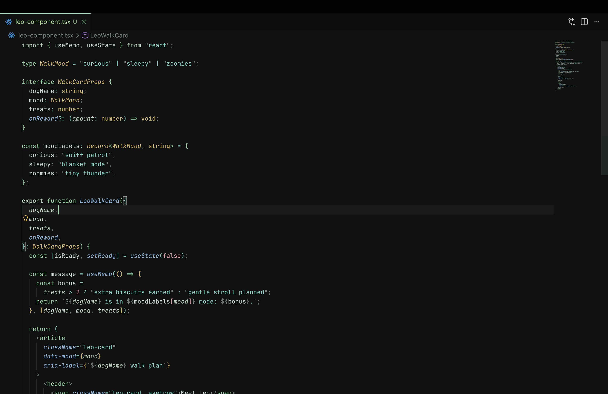
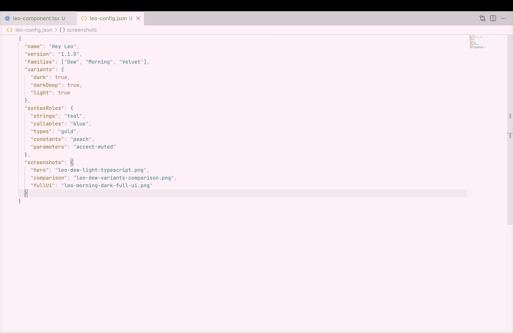
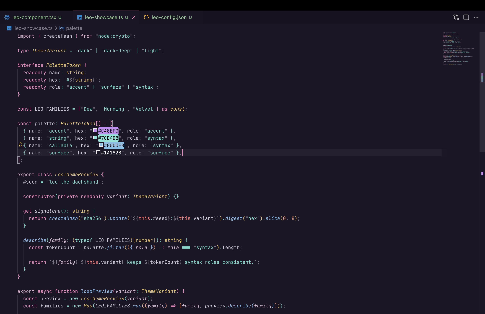
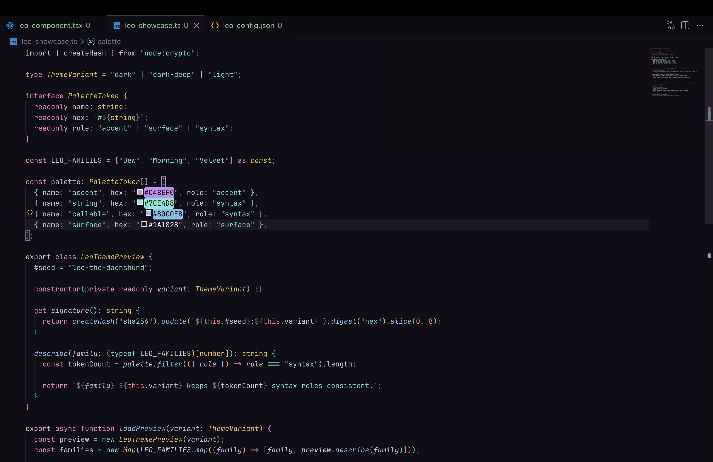

# Leo 🐶

> Curated pastel themes for Visual Studio Code - named after Leo the dachshund.

Leo is a focused collection of **3 pastel theme families** with a shared palette backbone, softer UI hierarchy, and consistent syntax-role mapping across every flavor. Each family ships in **Dark**, **Dark Deep**, and **Light** variants.

Published on the VS Code Marketplace as [Hey Leo](https://marketplace.visualstudio.com/items?itemName=pashanaumov.leo-themes).

---

## Themes

| Theme           | Personality     | Variants                 |
| --------------- | --------------- | ------------------------ |
| **Leo Dew**     | Cool lilac      | Dark / Dark Deep / Light |
| **Leo Morning** | Fresh mint      | Dark / Dark Deep / Light |
| **Leo Velvet**  | Expressive pink | Dark / Dark Deep / Light |

---

## Screenshots

### Leo Dew







### Leo Morning







### Leo Velvet







---

## Installation

1. Open VS Code
2. Go to **Extensions** (`Shift+Cmd+X`)
3. Search **Hey Leo**
4. Click **Install** and select your favourite variant from `Preferences > Color Theme`

---

## Development

```sh
npm run generate
npm run package:check
```

Theme JSON files are generated from `scripts/generate-themes.mjs`. See `CONTRIBUTING.md` for local development and `docs/release.md` for release steps.

---

## Recommended Settings

```json
{
  "workbench.colorTheme": "Leo Dew Dark",
  "editor.fontFamily": "JetBrains Mono, Fira Code, Menlo, monospace",
  "editor.fontLigatures": true,
  "editor.cursorBlinking": "smooth",
  "editor.cursorSmoothCaretAnimation": "on",
  "editor.fontWeight": "400",
  "workbench.fontAliasing": "antialiased",
  "editor.fontSize": 12.5,
  "editor.fontVariations": true
}
```

---

## License

MIT - made with love for Leo 🐾 by [pashanaumov](https://github.com/pashanaumov)
